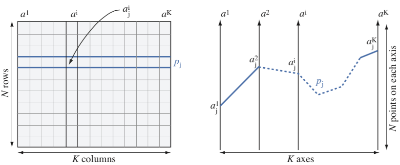

## Content

- Parallel coordinates
- Heatmaps
- Scatter plots
- Projections
- Biplots
- Treemaps


```{r}
# getwd()

library(reticulate)
use_python("/opt/conda/bin/python", required = TRUE)
```

---

## Parallel coordinates design {.smaller}

{fig-align="center"}

:::: {.columns }
::: {.column width="50%"}
- `row`: horizontal line
- `column`: vertical line
- `column-column correlation`: not easy to see
:::
::: {.column width="50%"}
- `row`: skewed polyline
- `column`: vertical line (permuted values)
- `column-column correlation`: easy to see
:::
::::

---

## Parallel coordinates in plotly {.smaller}

```{.python}
wideTable["older"] = wideTable["older"].astype(int)           # exergame_parallel.ipynb
fig = px.parallel_coordinates(wideTable[wideTable.columns[5:]],color='older')
```

```{python}
import pandas as pd
import plotly.express as px
wideTable = pd.read_csv("../../data/exergamewf.csv")
# https://plotly.com/python/colorscales/
wideTable["older"] = wideTable["older"].astype(int)
fig = px.parallel_coordinates(wideTable[wideTable.columns[5:]],color='older')
# fig.update_layout(autosize=False,width=800,height=400)
fig.show()  
```

- Highlight all rows (lines) passing through selection
- Drag and drop axis horizontally


---

## Parallel coordinates (ggplot)

```{r}
#| echo: true
#| code-line-numbers: "4-6"
library(ggplot2)
library(data.table)
longTable = fread('../../data/exergamelf2.csv')
ggplot(data=longTable,aes(x=myVars,y=normVal)) +
    geom_line(aes(group=idrow,colour=older),alpha=0.5) +
    theme_bw()
```

---

## Heatmap

- a rectangular tiling of a color-shaded data matrix
- each tile can be as small as a pixel
- limited by the size/resolution of the screen
- color-shading functions are very sensitive to outliers

---

## Measles heatmap {.scrollable}

```{python}
import pandas as pd
import plotly.graph_objects as go

longTable = pd.read_csv('../../data/measlesCleaned.csv')
longTable = longTable[longTable.year > 1920]
# longTable.head()

fig = go.Figure(data=go.Heatmap(
        z=longTable['Measles_pop'],
        x=longTable['year'],
        y=longTable['State_Name'],
        xgap=2,
        ygap=2,
        colorscale=['#ddebf8','#0c9dc5','#44ae57','#fcd43d','#e59e26','#e48925','#e95034','#da4b31','#cf472e']));

fig.update_layout(
    # title='',
    # xaxis_nticks=40,
    autosize=False,width=1000,height=900);

fig.show()
```

---

## Packages and data

```{python, engine="python"}
#| echo: true
#| eval: true

# Importing the packages
import plotly.express as px
import pandas as pd
# Loading and displaying the data
tableRes = pd.read_csv('../../data/exergamewf.csv')

tableRes["Participants"] = "Participants" # in order to have a single root node
tableRes["ppt"] = tableRes["iSubj"].astype(str)
tableRes["strial"] = tableRes["trial"].astype(str)
tableRes.head()

```
---

## Treemap source code

```{python}
#| echo: true

fig = px.treemap(tableRes, path=['Participants', 'iSubj', 'trial'], 
                values='Age', color='medSpeed', 
#               hover_data=['Age'],
#               Try a diverging color scale,
                color_continuous_scale=['#d7191c','#fdae61','#ffffbf',
                '#abd9e9','#2c7bb6'] 
                )
fig.update_layout(
    autosize=False,width=1000,height=600);

```

---
### Treemap showing speed values per participant
```{python}
#| echo: true

fig.show()
```
